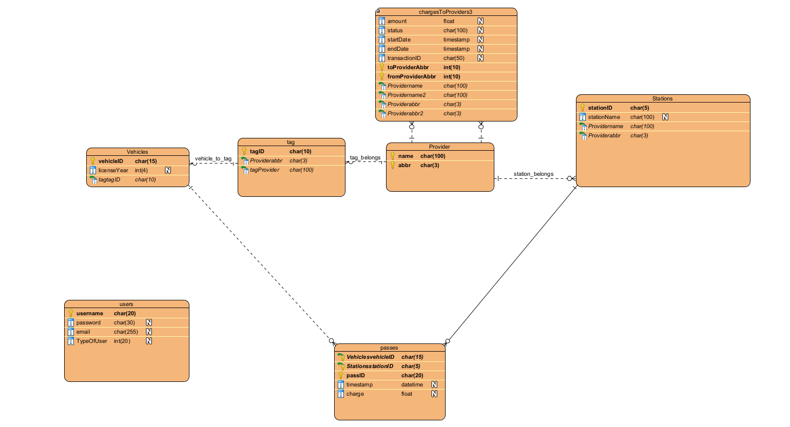

# Database readme
This is basic folder for our database.
You can find the table of contents below:
<!-- @import "[TOC]" {cmd="toc" depthFrom=1 depthTo=6 orderedList=false} -->

- [Defaults users](#defaults-users)
- [Before running it for the first time.](#before-running-it-for-the-first-time)
- [Database Scheema](#database-scheema)
- [To delete Data ](#to-delete-data)
- [Errors](#errors)

# Before running it for the first time.
1. We recumend using python 3.8 +
2. Add the following python packages : ```pip install pymysql, sys, pandas, numpy, datetime```
3. Create a MySQL database with name: softeng on port 3306
4. Create the database with the SQL code you will find on the createdb.sql file. 
4. Run python3 ```addData.py``` to add the database data.

# Database Scheema
 


 # To delete Data 
Follow the dependacy you see in the truncate.sql file.

# Errors
In case there is an error with addData.py you could try and insert data from the insertdata.sql where all the data have sql form , from the user interface of your database service.

# Defaults users
We have created 2 default users to make it easier:
1. admin : Softeng2022 [admin]
2. user : Softeng2022 [user]